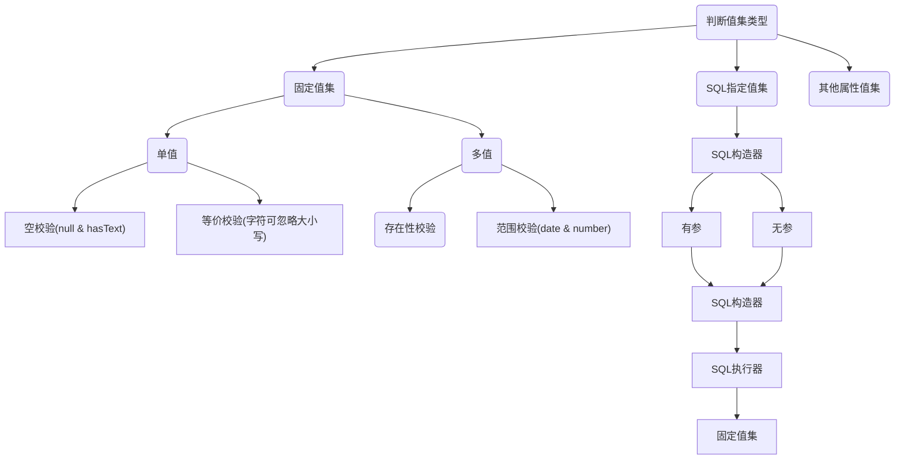

- 待开发

- [X] 判断值集类型
- [ ] SQL构造器
- [ ] SQL执行器
- [X] 其他属性值集

```mermaid
graph TD
	A(判断值集类型)-->B1(固定值集)
	A-->B2(SQL指定值集)
        A-->B3(其他属性值集)
	B1-->C1(单值)
	B1-->C2(多值)
	C1-->D1["空校验(null & hasText)"]
        C1-->D2["等价校验(字符可忽略大小写)"]
        C2-->D3(存在性校验)
        C2-->D4["范围校验(date & number)"]  
        B2-->C10["SQL构造器"]
        C10-->D60["无参"]
        C10-->D50["有参"]
        D50-->E10["SQL构造器"]
        E10-->E20["SQL执行器"]
        D60-->E10
        E20-->F10["固定值集"]
```

```mermaid
graph 
	A(判断值集类型)-->B1(固定值集)
	A-->B2(SQL指定值集)
        A-->B3(其他属性值集)
	B1-->C1(单值)
	B1-->C2(多值)
	C1-->D1["空校验(null & hasText)"]
        C1-->D2["等价校验(字符可忽略大小写)"]
        C2-->D3(存在性校验)
        C2-->D4["范围校验(date & number)"]  
        B2-->C10["SQL构造器"]
        C10-->D60["无参"]
        C10-->D50["有参"]
        D50-->E10["SQL构造器"]
        E10-->E20["SQL执行器"]
        D60-->E10
        E20-->F10["固定值集"]
```
